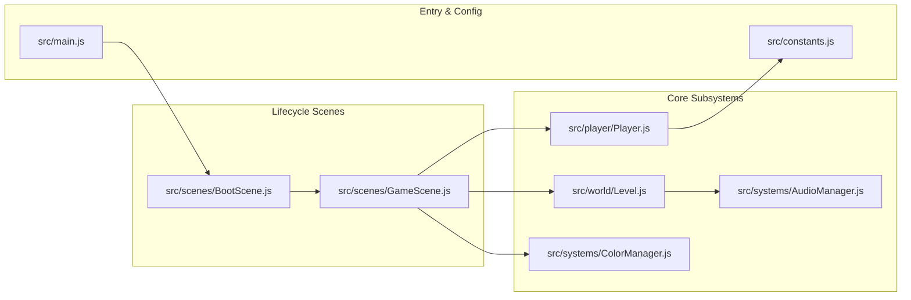

# Overview
Relevant source files
- [README.md](https://github.com/brokemutt/gdweb/blob/1c1d347a/README.md?plain=1)
- [index.html](https://github.com/brokemutt/gdweb/blob/1c1d347a/index.html)
- [src/main.js](https://github.com/brokemutt/gdweb/blob/1c1d347a/src/main.js)

`gdweb` is a technical reconstruction of the official Geometry Dash web demo, specifically the version released on April 3, 2026, featuring the first level, "Stereo Madness" [README.md1-4](https://github.com/brokemutt/gdweb/blob/1c1d347a/README.md?plain=1#L1-L4) This project represents a complete reverse-engineering effort to transform the original obfuscated and minified source code into a clean, modular, and maintainable codebase that follows modern game development patterns [README.md9-11](https://github.com/brokemutt/gdweb/blob/1c1d347a/README.md?plain=1#L9-L11)

While the original source was processed via `obfuscator.io`[README.md18](https://github.com/brokemutt/gdweb/blob/1c1d347a/README.md?plain=1#L18-L18) this repository organizes the logic into discrete subsystems (player, scenes, systems, world) to mirror the architecture of contemporary game engines [README.md11](https://github.com/brokemutt/gdweb/blob/1c1d347a/README.md?plain=1#L11-L11)

## Tech Stack

The project is built using a modern web-based stack designed for high-performance 2D rendering and efficient asset handling:

| Component | Technology | Role |
| --- | --- | --- |
| **Engine** | **Phaser 3** | Handles the scene graph, rendering (WebGL/Canvas), input, and asset management [src/main.js4-21](https://github.com/brokemutt/gdweb/blob/1c1d347a/src/main.js#L4-L21) |
| **Bundler** | **Vite** | Orchestrates the build pipeline and provides a development server [README.md32](https://github.com/brokemutt/gdweb/blob/1c1d347a/README.md?plain=1#L32-L32) |
| **Compression** | **pako** | Used for decompressing the level data stored in `assets/1.txt`[index.html16](https://github.com/brokemutt/gdweb/blob/1c1d347a/index.html#L16-L16) |
| **Language** | **ES6+ JavaScript** | Utilizes modern module syntax and class-based structures. |

## High-Level Architecture

The application transitions from a setup phase into a persistent game loop. The lifecycle is managed by the `phaserConfig` object which defines the sequence of scenes: `[BootScene, GameScene]`[src/main.js20-41](https://github.com/brokemutt/gdweb/blob/1c1d347a/src/main.js#L20-L41)

### System Relationship Diagram

The following diagram illustrates how the major code entities interact to drive the gameplay experience.

**Entity Interaction Map**

Sources: [src/main.js40-41](https://github.com/brokemutt/gdweb/blob/1c1d347a/src/main.js#L40-L41)[src/scenes/BootScene.js1-10](https://github.com/brokemutt/gdweb/blob/1c1d347a/src/scenes/BootScene.js#L1-L10)[src/scenes/GameScene.js1-20](https://github.com/brokemutt/gdweb/blob/1c1d347a/src/scenes/GameScene.js#L1-L20)

## Major Subsystems

### 1. Scene Management

The game logic is split between two primary scenes. `BootScene` handles the initial asset loading, including the `GJ_WebSheet` texture atlas and level data [src/scenes/BootScene.js](https://github.com/brokemutt/gdweb/blob/1c1d347a/src/scenes/BootScene.js) Once loading is complete, control is handed to `GameScene`, which serves as the central hub for the UI, physics sub-stepping, and camera management [src/scenes/GameScene.js](https://github.com/brokemutt/gdweb/blob/1c1d347a/src/scenes/GameScene.js)

### 2. Player System

The player is managed via `PlayerClass` (physics and state) and `PlayerRenderer` (visuals). It supports multiple movement modes, such as the standard Cube and the flying Ship mode, governed by constants like `PLAYER_SPEED` and `JUMP_VELOCITY`[src/constants.js11-14](https://github.com/brokemutt/gdweb/blob/1c1d347a/src/constants.js#L11-L14)

### 3. Level & World Management

Levels are stored as compressed strings. The `LevelLoader` decodes and decompresses these using `pako`, while the `Level` class manages the runtime instantiation of objects and section-based culling to maintain performance [src/world/Level.js](https://github.com/brokemutt/gdweb/blob/1c1d347a/src/world/Level.js)

### 4. Support Systems

- **AudioManager:** Handles music playback and real-time audio metering to drive visual effects [src/systems/AudioManager.js](https://github.com/brokemutt/gdweb/blob/1c1d347a/src/systems/AudioManager.js)
- **ColorManager:** Manages background and ground color transitions triggered by level events [src/systems/ColorManager.js](https://github.com/brokemutt/gdweb/blob/1c1d347a/src/systems/ColorManager.js)
- **GameState:** A shared data structure tracking the player's current physical state (e.g., `onGround`, `isDead`) [src/systems/GameState.js](https://github.com/brokemutt/gdweb/blob/1c1d347a/src/systems/GameState.js)

## Child Pages

For detailed technical documentation on specific areas of the codebase, refer to the following pages:

- **[Getting Started](/brokemutt/gdweb/1.1-getting-started):** Instructions for local development, production builds, and handling the domain-lock security feature.
- **[Project Structure](/brokemutt/gdweb/1.2-project-structure):** A deep dive into the repository layout and the purpose of each directory in the `src/` tree.

---

Sources: [README.md9-35](https://github.com/brokemutt/gdweb/blob/1c1d347a/README.md?plain=1#L9-L35)[src/main.js1-43](https://github.com/brokemutt/gdweb/blob/1c1d347a/src/main.js#L1-L43)[src/constants.js1-20](https://github.com/brokemutt/gdweb/blob/1c1d347a/src/constants.js#L1-L20)[index.html1-31](https://github.com/brokemutt/gdweb/blob/1c1d347a/index.html#L1-L31)