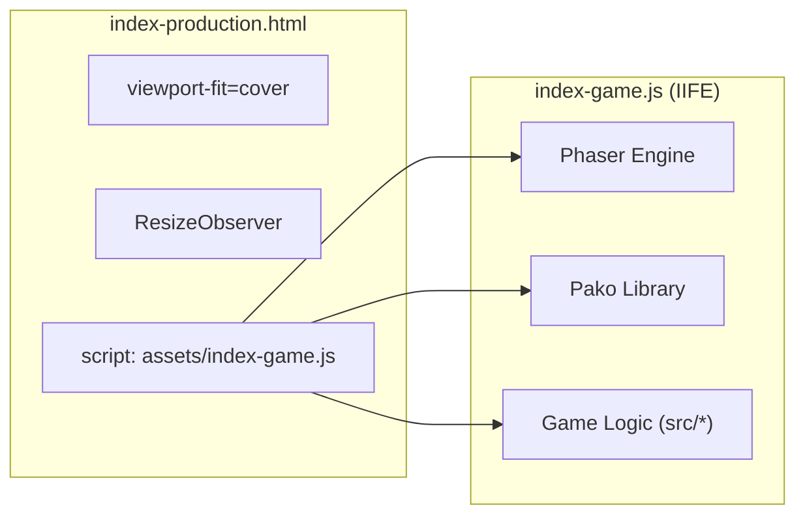

# Getting Started
Relevant source files
- [README.md](https://github.com/brokemutt/gdweb/blob/1c1d347a/README.md?plain=1)
- [index-production.html](https://github.com/brokemutt/gdweb/blob/1c1d347a/index-production.html)
- [index.html](https://github.com/brokemutt/gdweb/blob/1c1d347a/index.html)
- [package.json](https://github.com/brokemutt/gdweb/blob/1c1d347a/package.json)
- [vite.config.js](https://github.com/brokemutt/gdweb/blob/1c1d347a/vite.config.js)

This page provides a technical guide for setting up, running, and building the **gdweb** project. It covers the transition from a development environment to a production-ready bundle, detailing the underlying build pipeline and dependency management.

## Project Setup and Dependencies

The project relies on a modern JavaScript stack, utilizing **Vite** as the build tool and **Phaser 3** as the primary game engine. Dependencies are managed via `npm` and are defined in the project root.

| Dependency | Version | Role |
| --- | --- | --- |
| `phaser` | `3.90.0` | Core game engine for rendering and scene management. |
| `pako` | `^2.1.0` | Zlib decompression for level data parsing. |
| `vite` | `^5.4.0` | Development server and build bundler. |
| `terser` | `^5.46.1` | JavaScript minification and obfuscation for production. |

### Installation

To initialize the environment, execute the following command in the repository root:

```
npm install
```

**Sources:**[package.json7-12](https://github.com/brokemutt/gdweb/blob/1c1d347a/package.json#L7-L12)[README.md29](https://github.com/brokemutt/gdweb/blob/1c1d347a/README.md?plain=1#L29-L29)

---

## Development Workflows

The codebase supports two distinct workflows: **Live Development** for rapid iteration and **Production Build** for generating an optimized distribution.

### 1. Live Development

For instant testing without a compilation step, the project can be served directly from the root. This mode utilizes the browser's native ES module support and an `importmap` to resolve external libraries.

- **Command:**`npx serve` (or any static file server).
- **Entry Point:**`index.html`.
- **Module Resolution:** The `index.html` file defines an `importmap` to load `phaser` and `pako` from CDNs [index.html12-19](https://github.com/brokemutt/gdweb/blob/1c1d347a/index.html#L12-L19)
- **Source Loading:** It loads the uncompiled source via `<script type="module" src="/src/main.js"></script>`[index.html20](https://github.com/brokemutt/gdweb/blob/1c1d347a/index.html#L20-L20)

### 2. Production Build Pipeline

The production workflow uses Vite to bundle all source files into a single, minified JavaScript blob.

- **Command:**`npm run build` (which triggers `vite build`) [package.json5](https://github.com/brokemutt/gdweb/blob/1c1d347a/package.json#L5-L5)
- **Process:**
1. **Bundling:** Vite resolves `src/main.js` and all its imports into an IIFE (Immediately Invoked Function Expression) format [vite.config.js9-13](https://github.com/brokemutt/gdweb/blob/1c1d347a/vite.config.js#L9-L13)
2. **Minification:**`terser` is used to mangle names, remove comments, and drop `console.log` statements to reduce file size [vite.config.js15-28](https://github.com/brokemutt/gdweb/blob/1c1d347a/vite.config.js#L15-L28)
3. **Asset Management:** A custom Vite plugin copies the `assets/` directory and `index-production.html` to the `dist/` folder [vite.config.js35-51](https://github.com/brokemutt/gdweb/blob/1c1d347a/vite.config.js#L35-L51)

**Sources:**[README.md23-32](https://github.com/brokemutt/gdweb/blob/1c1d347a/README.md?plain=1#L23-L32)[vite.config.js5-34](https://github.com/brokemutt/gdweb/blob/1c1d347a/vite.config.js#L5-L34)[index.html12-20](https://github.com/brokemutt/gdweb/blob/1c1d347a/index.html#L12-L20)

---

## Build Pipeline Architecture

The following diagram illustrates the data flow from source code and assets to the final production distribution.

**Build Pipeline Data Flow**

```

```

**Sources:**[vite.config.js5-52](https://github.com/brokemutt/gdweb/blob/1c1d347a/vite.config.js#L5-L52)[package.json3-6](https://github.com/brokemutt/gdweb/blob/1c1d347a/package.json#L3-L6)[README.md32](https://github.com/brokemutt/gdweb/blob/1c1d347a/README.md?plain=1#L32-L32)

---

## Technical Implementation Details

### The Domain Lock

A notable security feature from the original web demo is the **domain lock**. In the original obfuscated code, this prevented the script from running on unauthorized domains. In this repository, the domain lock logic in `src/main.js` has been commented out to allow for local development and personal hosting.

**Sources:**[README.md14](https://github.com/brokemutt/gdweb/blob/1c1d347a/README.md?plain=1#L14-L14)[README.md34](https://github.com/brokemutt/gdweb/blob/1c1d347a/README.md?plain=1#L34-L34)

### Production Entry Point

The production build uses a specialized HTML file, `index-production.html`. Unlike the development `index.html`, it does not use an `importmap`. Instead, it expects the entire game logic to be contained within `assets/index-game.js`, which is generated during the build process.

**Production HTML Structure**



**Sources:**[index-production.html1-23](https://github.com/brokemutt/gdweb/blob/1c1d347a/index-production.html#L1-L23)[vite.config.js9-13](https://github.com/brokemutt/gdweb/blob/1c1d347a/vite.config.js#L9-L13)

### Build Output Mapping

The build configuration ensures that the file structure remains clean. The `outDir` is set to `dist`, and the `lib` configuration specifically names the output bundle.

| Config Key | Value | Purpose |
| --- | --- | --- |
| `entry` | `src/main.js` | The root of the dependency graph [vite.config.js11](https://github.com/brokemutt/gdweb/blob/1c1d347a/vite.config.js#L11-L11) |
| `fileName` | `assets/index-game.js` | The final location of the bundled JS [vite.config.js12](https://github.com/brokemutt/gdweb/blob/1c1d347a/vite.config.js#L12-L12) |
| `formats` | `['iife']` | Ensures the script runs immediately in the browser [vite.config.js13](https://github.com/brokemutt/gdweb/blob/1c1d347a/vite.config.js#L13-L13) |
| `emptyOutDir` | `true` | Cleans the `dist` folder before every build [vite.config.js8](https://github.com/brokemutt/gdweb/blob/1c1d347a/vite.config.js#L8-L8) |

**Sources:**[vite.config.js5-34](https://github.com/brokemutt/gdweb/blob/1c1d347a/vite.config.js#L5-L34)