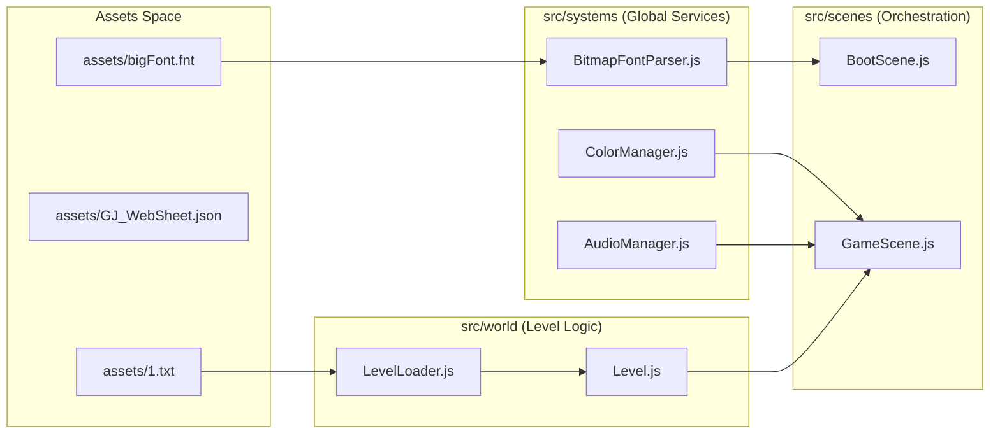
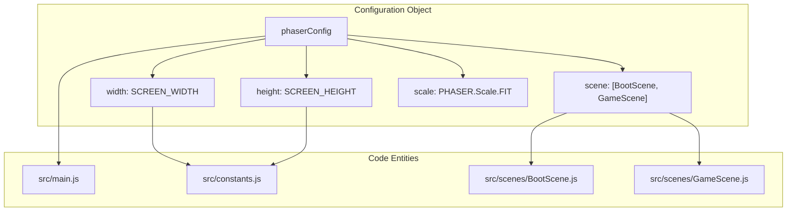

# Project Structure
Relevant source files
- [.gitignore](https://github.com/brokemutt/gdweb/blob/1c1d347a/.gitignore)
- [README.md](https://github.com/brokemutt/gdweb/blob/1c1d347a/README.md?plain=1)
- [src/main.js](https://github.com/brokemutt/gdweb/blob/1c1d347a/src/main.js)

This page details the repository layout and architectural philosophy of the `gdweb` codebase. Unlike the original production build, which was distributed as a single obfuscated JavaScript blob, this repository is organized to mirror modern game engine conventions. The structure separates concerns into discrete modules for physics, rendering, scene management, and world logic.

## Repository Layout

The project follows a standard Vite-based web application structure. The `src/` directory contains the reverse-engineered logic, while `assets/` houses the binary and graphical data required by the game.

### Root Directory

The root contains configuration files and the entry point for the build pipeline.

| File | Purpose |
| --- | --- |
| `index.html` | The main entry point for the browser. It loads `src/main.js`. |
| `vite.config.js` | Configuration for the Vite bundler, defining how the `src/` directory is compiled into `dist/assets/index-game.js`. |
| `package.json` | Defines dependencies (Phaser 3, pako) and build scripts (`npm run build`). |
| `.gitignore` | Prevents `node_modules/` and the `dist/` build folder from being tracked [ .gitignore1-2](https://github.com/brokemutt/gdweb/blob/1c1d347a/ .gitignore#L1-L2) |

### The `src/` Directory

The `src/` directory is organized by domain responsibility to ensure maintainability.

- **`player/`**: Contains `Player.js` (physics and state) and `PlayerRenderer.js` (visuals and trails).
- **`scenes/`**: Manages the Phaser scene lifecycle, including `BootScene.js` for asset loading and `GameScene.js` for the main loop.
- **`systems/`**: Core utility modules including the `AudioManager`, `ColorManager`, `BitmapFontParser`, and global `GameState`.
- **`world/`**: Handles level data parsing (`LevelLoader.js`) and runtime world management (`Level.js`).

**Sources:**[ README.md11](https://github.com/brokemutt/gdweb/blob/1c1d347a/ README.md?plain=1#L11-L11)[ src/main.js4-7](https://github.com/brokemutt/gdweb/blob/1c1d347a/ src/main.js#L4-L7)

---

## Architectural Philosophy

The primary goal of this structure is to de-obfuscate the original logic into a readable, modular format. The data flow follows a "System-Scene-Entity" pattern where global systems provide services to the active Phaser scene, which in turn manages game entities.

### Data Flow & Dependency Diagram

This diagram illustrates how the project structure facilitates the flow of data from raw assets to the rendered game loop.

**Data Flow: Asset to Screen**

**Sources:**[ src/main.js40](https://github.com/brokemutt/gdweb/blob/1c1d347a/ src/main.js#L40-L40)[ src/scenes/BootScene.js1-40](https://github.com/brokemutt/gdweb/blob/1c1d347a/ src/scenes/BootScene.js#L1-L40)[ src/world/LevelLoader.js1-20](https://github.com/brokemutt/gdweb/blob/1c1d347a/ src/world/LevelLoader.js#L1-L20)

---

## Key Subdirectories

### `src/player`

Splits the player into two distinct halves: logic and presentation. `PlayerClass` in `Player.js` handles the 240Hz physics sub-stepping, while `PlayerRenderer` handles the Phaser sprite stack and particle emitters.

### `src/systems`

These are standalone modules that do not depend on the Phaser scene graph directly but are utilized by scenes.

- **`AudioManager.js`**: Wraps Web Audio API for music metering.
- **`ColorManager.js`**: Manages the `ID_BACKGROUND_COLOR` and `ID_GROUND_COLOR` transitions.
- **`BitmapFontParser.js`**: Manages the manual registration of AngelCode BMFont data into the Phaser cache.

### `src/world`

Responsible for the "infinite" feel of the level. It uses a section-based culling system (400px sections) to manage performance, defined in `Level.js`.

**Sources:**[ README.md10-11](https://github.com/brokemutt/gdweb/blob/1c1d347a/ README.md?plain=1#L10-L11)[ src/main.js5-7](https://github.com/brokemutt/gdweb/blob/1c1d347a/ src/main.js#L5-L7)

---

## Entry Point: `main.js`

The `src/main.js` file serves as the glue for the entire project. It initializes the `Phaser.Game` instance and configures the global engine settings.

### Phaser Configuration Mapping

This diagram bridges the natural language configuration to the specific code identifiers used in the initialization.

**System Mapping: Phaser Initialization**

| Identifier | Source | Role |
| --- | --- | --- |
| `phaserConfig` | [ src/main.js20](https://github.com/brokemutt/gdweb/blob/1c1d347a/ src/main.js#L20-L20) | The primary configuration object for the Phaser engine. |
| `SCREEN_WIDTH` | [ src/constants.js ](https://github.com/brokemutt/gdweb/blob/1c1d347a/ src/constants.js ) | Imported constant defining the base resolution width. |
| `BootScene` | [ src/scenes/BootScene.js ](https://github.com/brokemutt/gdweb/blob/1c1d347a/ src/scenes/BootScene.js ) | The first scene in the array, responsible for initial load. |
| `GameScene` | [ src/scenes/GameScene.js ](https://github.com/brokemutt/gdweb/blob/1c1d347a/ src/scenes/GameScene.js ) | The main gameplay scene. |

**Sources:**[ src/main.js20-43](https://github.com/brokemutt/gdweb/blob/1c1d347a/ src/main.js#L20-L43)[ src/main.js5-7](https://github.com/brokemutt/gdweb/blob/1c1d347a/ src/main.js#L5-L7)