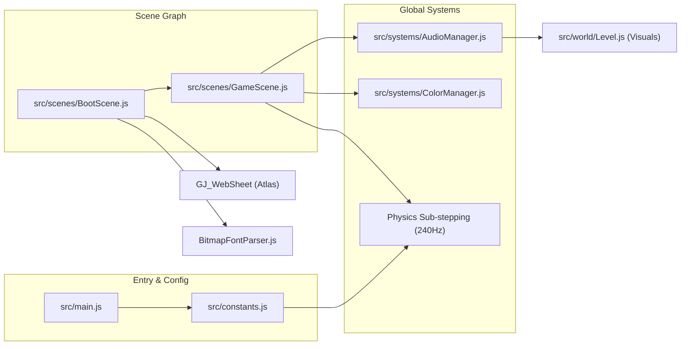
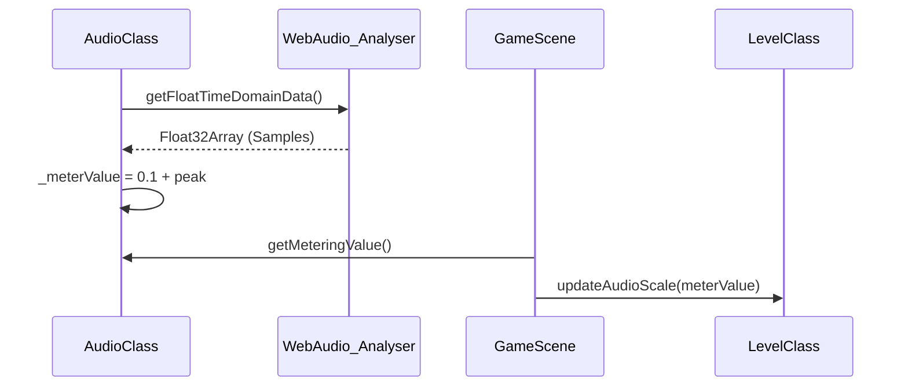

# Core Architecture
Relevant source files
- [src/constants.js](https://github.com/brokemutt/gdweb/blob/1c1d347a/src/constants.js)
- [src/main.js](https://github.com/brokemutt/gdweb/blob/1c1d347a/src/main.js)
- [src/scenes/BootScene.js](https://github.com/brokemutt/gdweb/blob/1c1d347a/src/scenes/BootScene.js)
- [src/systems/AudioManager.js](https://github.com/brokemutt/gdweb/blob/1c1d347a/src/systems/AudioManager.js)

The **gdweb** architecture is built on the Phaser 3 framework, employing a deterministic physics loop decoupled from the rendering framerate. The system is organized into a two-scene lifecycle that transitions from asset preparation to a high-performance game loop capable of sub-stepping physics at 240Hz.

## Scene Lifecycle and Module Boundaries

The application follows a linear progression from initialization to gameplay. The `phaserConfig` defined in `src/main.js`[src/main.js20-41](https://github.com/brokemutt/gdweb/blob/1c1d347a/src/main.js#L20-L41) orchestrates this by loading two primary scenes in sequence: `BootScene` and `GameScene`.

1. **BootScene**: Responsible for the initial WebGL context setup, asset loading (textures, audio, level data), and bitmap font parsing [src/scenes/BootScene.js14-57](https://github.com/brokemutt/gdweb/blob/1c1d347a/src/scenes/BootScene.js#L14-L57)
2. **GameScene**: The main orchestrator that manages the player, the level geometry, the physics sub-stepping loop, and the UI state machine.

### System Interaction Map

The diagram below illustrates how the core systems communicate across the module boundaries.

**System Interconnectivity**

**Sources:**[src/main.js40-43](https://github.com/brokemutt/gdweb/blob/1c1d347a/src/main.js#L40-L43)[src/scenes/BootScene.js69-70](https://github.com/brokemutt/gdweb/blob/1c1d347a/src/scenes/BootScene.js#L69-L70)[src/systems/AudioManager.js100-135](https://github.com/brokemutt/gdweb/blob/1c1d347a/src/systems/AudioManager.js#L100-L135)

---

## Application Entry Point & Phaser Configuration

The game initializes via `src/main.js`, which configures the Phaser `Game` instance. Key configurations include `PHASER.Scale.FIT` for responsive scaling and a `smoothStep` FPS setting to maintain visual stability [src/main.js25-39](https://github.com/brokemutt/gdweb/blob/1c1d347a/src/main.js#L25-L39)

For a deep dive into the initialization logic and the domain-lock security block, see **[Application Entry Point & Phaser Configuration](/brokemutt/gdweb/2.1-application-entry-point-and-phaser-configuration)**.

**Sources:**[src/main.js20-41](https://github.com/brokemutt/gdweb/blob/1c1d347a/src/main.js#L20-L41)

---

## Global Constants & Coordinate System

Central to the architecture is `src/constants.js`, which defines the "Source of Truth" for the physics engine and the coordinate transformation logic. Because the game uses a fixed internal height of 640px [src/constants.js4](https://github.com/brokemutt/gdweb/blob/1c1d347a/src/constants.js#L4-L4) it employs a transformation function `worldYToScreenY` to map game-world coordinates to the screen [src/constants.js36-38](https://github.com/brokemutt/gdweb/blob/1c1d347a/src/constants.js#L36-L38)

For details on physics deltas, object type enumerations, and coordinate mapping, see **[Global Constants & Coordinate System](/brokemutt/gdweb/2.2-global-constants-and-coordinate-system)**.

**Sources:**[src/constants.js1-66](https://github.com/brokemutt/gdweb/blob/1c1d347a/src/constants.js#L1-L66)

---

## Boot Scene & Asset Loading

The `BootScene` handles the transition from "Natural Language" asset keys to "Code Entity" resources. It performs critical WebGL blend mode registrations (e.g., `BLEND_ADD` for glow effects) [src/scenes/BootScene.js16-20](https://github.com/brokemutt/gdweb/blob/1c1d347a/src/scenes/BootScene.js#L16-L20) and utilizes the `BitmapFontParser` to register custom fonts into the Phaser cache [src/scenes/BootScene.js63-66](https://github.com/brokemutt/gdweb/blob/1c1d347a/src/scenes/BootScene.js#L63-L66)

For details on the loading pipeline and asset manifest, see **[Boot Scene & Asset Loading](/brokemutt/gdweb/2.3-boot-scene-and-asset-loading)**.

**Sources:**[src/scenes/BootScene.js14-71](https://github.com/brokemutt/gdweb/blob/1c1d347a/src/scenes/BootScene.js#L14-L71)

---

## Architectural Mapping: Data to Entities

The following table maps conceptual game systems to their specific implementation classes and files to assist in codebase navigation.

| System | Code Entity | File Path |
| --- | --- | --- |
| **Audio Metering** | `AudioClass` | [src/systems/AudioManager.js4-146](https://github.com/brokemutt/gdweb/blob/1c1d347a/src/systems/AudioManager.js#L4-L146) |
| **Font Processing** | `parseBMFont` | [src/systems/BitmapFontParser.js](https://github.com/brokemutt/gdweb/blob/1c1d347a/src/systems/BitmapFontParser.js) |
| **Physics Constants** | `TICK_DELTA`, `PLAYER_SPEED` | [src/constants.js18-21](https://github.com/brokemutt/gdweb/blob/1c1d347a/src/constants.js#L18-L21) |
| **Rendering Modes** | `BLEND_ADD`, `BLEND_NORMAL` | [src/constants.js40-48](https://github.com/brokemutt/gdweb/blob/1c1d347a/src/constants.js#L40-L48) |
| **Scene Orchestration** | `GameScene` | [src/scenes/GameScene.js](https://github.com/brokemutt/gdweb/blob/1c1d347a/src/scenes/GameScene.js) |

### Physics and Audio Synchronization

One unique architectural feature is the link between the `AudioClass` and the visual world. The `AudioClass` uses a `Web Audio API``AnalyserNode` to calculate a `_meterValue`[src/systems/AudioManager.js92-114](https://github.com/brokemutt/gdweb/blob/1c1d347a/src/systems/AudioManager.js#L92-L114) This value is exported and used by the `Level` system to scale visual elements (like ground pulses) in sync with the music.

**Audio-Visual Data Flow**

**Sources:**[src/systems/AudioManager.js92-138](https://github.com/brokemutt/gdweb/blob/1c1d347a/src/systems/AudioManager.js#L92-L138)