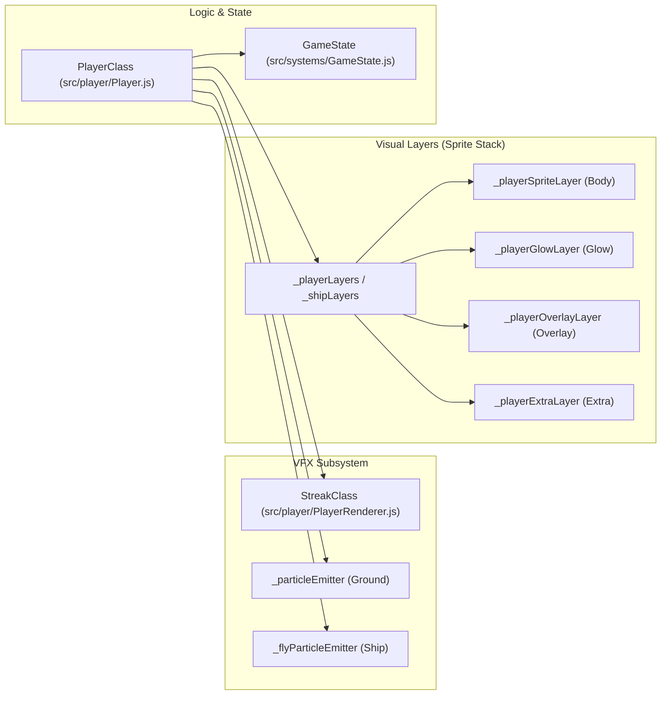
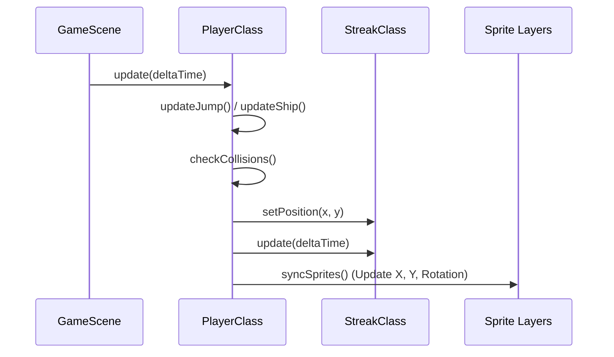

# Player System
Relevant source files
- [src/player/Player.js](https://github.com/brokemutt/gdweb/blob/1c1d347a/src/player/Player.js)
- [src/player/PlayerRenderer.js](https://github.com/brokemutt/gdweb/blob/1c1d347a/src/player/PlayerRenderer.js)

The **Player System** is the central component of `gdweb` gameplay, managing the physics, state transitions, and multi-layered visual representation of the player character. The system is split between `PlayerClass` in `src/player/Player.js`, which handles logic and state, and helper utilities in `src/player/PlayerRenderer.js` that manage visual effects like motion trails.

The system supports two distinct gameplay modes: **Cube** (standard platforming) and **Ship** (flappy-style flight), each with unique gravity, rotation, and particle behaviors [[src/player/Player.js:10-29]]().

### System Architecture

The player is not a single sprite but a collection of layers synchronized to a central state object (`GameState`). This allows for complex coloring (primary, secondary, and glow) and seamless transitions between vehicles.

#### Player Entity to Code Mapping

The following diagram bridges the high-level player concepts to the specific classes and layers defined in the codebase.

**Diagram: Player System Entity Map**

Sources: [[src/player/Player.js:10-29]](), [[src/player/Player.js:93-108]](), [[src/player/PlayerRenderer.js:8-26]]()

### Gameplay Modes

The player toggles between modes via portal collisions (e.g., `OBJECT_TYPE_PORTAL_SHIP`).

| Mode | Logic File | Primary Movement | Rotation Logic |
| --- | --- | --- | --- |
| **Cube** | `Player.js` | Jump on input (Velocity: `JUMP_VELOCITY`) | 90-degree increments via `rotateAction` |
| **Ship** | `Player.js` | Constant upward force while input held | Smooth `slerp2D` rotation based on Y velocity |

Sources: [[src/player/Player.js:6-7]](), [[src/constants.js:6-10]]()

### Visual Composition

The player's appearance is constructed by stacking multiple sprites with different depths and blend modes. This is handled by `_createSprites`[[src/player/Player.js:31-109]]() using the `createSpriteLayer` utility [[src/player/PlayerRenderer.js:114-123]]().

- **Layering:** Sprites are assigned depths ranging from 8 to 12 to ensure overlays and "extra" details (like eyes) appear above the main body [[src/player/Player.js:39-42]]().
- **Coloring:** Layers are tinted dynamically using constants like `COLOR_GREEN` (primary) and `COLOR_BLUE` (secondary/glow) [[src/player/Player.js:45-50]]().
- **Motion Trails:** The `StreakClass` manages a `Phaser.Graphics` object that draws a fading trail behind the player using `Phaser.BlendModes.ADD`[[src/player/PlayerRenderer.js:24-26]]().

**Diagram: Frame Update & Synchronization**

Sources: [[src/player/Player.js:10-29]](), [[src/player/PlayerRenderer.js:47-110]]()

### Child Pages

For detailed technical implementation of the physics engine and the rendering pipeline, see the following sub-pages:

- **[Player Physics & Collision](/brokemutt/gdweb/4.1-player-physics-and-collision)**: Detailed breakdown of the 240Hz physics loop, gravity calculations, collision detection against `OBJECT_TYPE_SOLID` and `OBJECT_TYPE_HAZARD`, and the death/reset sequence.
- **[Player Rendering & Visual Effects](/brokemutt/gdweb/4.2-player-rendering-and-visual-effects)**: Technical details on the multi-layer sprite stack, `slerp2D` rotation blending, particle emitter configurations for ground and air, and the `StreakClass` motion trail implementation.

Sources: [[src/player/Player.js:1-29]](), [[src/player/PlayerRenderer.js:1-7]]()