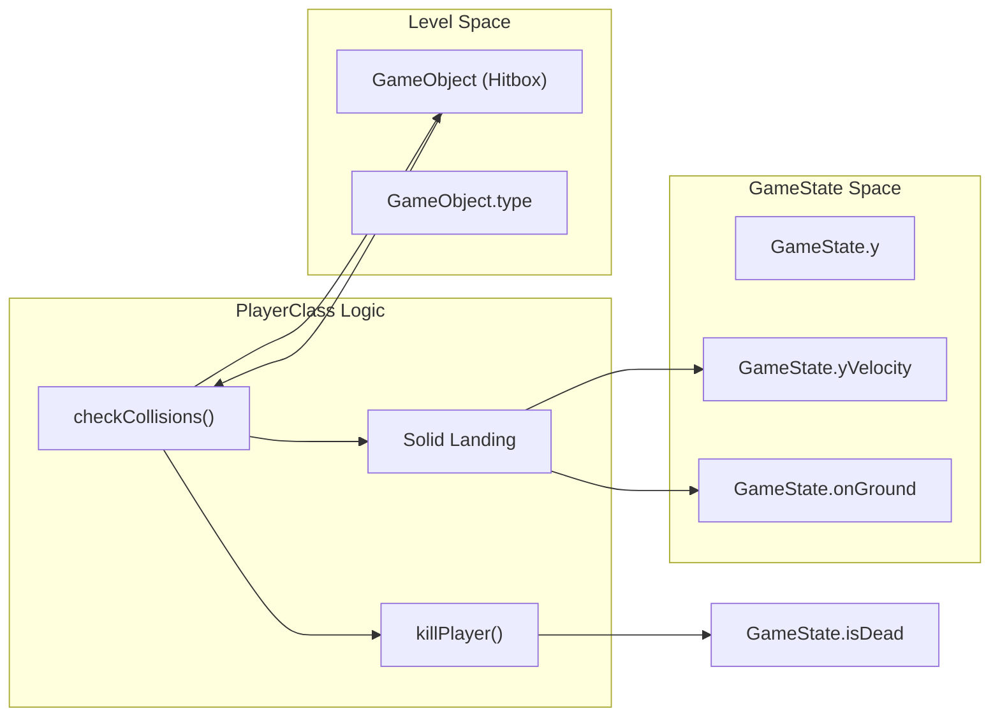
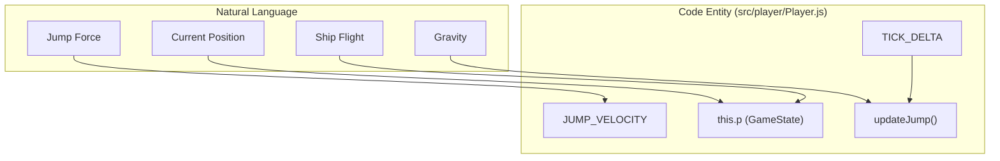

# Player Physics & Collision
Relevant source files
- [src/constants.js](https://github.com/brokemutt/gdweb/blob/1c1d347a/src/constants.js)
- [src/player/Player.js](https://github.com/brokemutt/gdweb/blob/1c1d347a/src/player/Player.js)
- [src/player/PlayerRenderer.js](https://github.com/brokemutt/gdweb/blob/1c1d347a/src/player/PlayerRenderer.js)
- [src/systems/GameState.js](https://github.com/brokemutt/gdweb/blob/1c1d347a/src/systems/GameState.js)

The `PlayerClass` is the central controller for the player's physical behavior, movement, and interaction with the game world. It manages two distinct physics modes (Cube and Ship), handles gravity calculations, and performs frame-by-frame collision detection against solid geometry and hazards.

## Movement and Jump Physics

The player's vertical movement is governed by `updateJump`, which applies different logic based on whether the player is in "Cube" mode or "Ship" mode. Horizontal movement is constant, defined by `PLAYER_SPEED`.

### Gravity and Velocity

- **Cube Mode**: Gravity is applied constantly to `yVelocity`. When the player is on the ground and the jump key is pressed, a fixed `JUMP_VELOCITY` is applied [src/player/Player.js336-350](https://github.com/brokemutt/gdweb/blob/1c1d347a/src/player/Player.js#L336-L350)
- **Ship Mode**: The physics shift to a "flight" model. Holding the jump key applies an upward force (modifying `yVelocity`), while releasing it allows gravity to pull the ship down [src/player/Player.js353-375](https://github.com/brokemutt/gdweb/blob/1c1d347a/src/player/Player.js#L353-L375)
- **Gravity Flip**: The system supports inverted gravity via `gravityFlipped`. When active, all vertical calculations (velocity additions and ground checks) are mathematically inverted [src/player/Player.js339-345](https://github.com/brokemutt/gdweb/blob/1c1d347a/src/player/Player.js#L339-L345)

### Jump Implementation Logic

| Mode | Input Trigger | Physics Result |
| --- | --- | --- |
| **Cube** | `upKeyPressed` | Sets `yVelocity` to `JUMP_VELOCITY` (or negative if flipped) [src/player/Player.js341-344](https://github.com/brokemutt/gdweb/blob/1c1d347a/src/player/Player.js#L341-L344) |
| **Ship** | `upKeyDown` | Increments/Decrements `yVelocity` by `0.35` per tick [src/player/Player.js355-365](https://github.com/brokemutt/gdweb/blob/1c1d347a/src/player/Player.js#L355-L365) |

**Sources:**[src/player/Player.js330-380](https://github.com/brokemutt/gdweb/blob/1c1d347a/src/player/Player.js#L330-L380)[src/constants.js18-22](https://github.com/brokemutt/gdweb/blob/1c1d347a/src/constants.js#L18-L22)[src/systems/GameState.js13-20](https://github.com/brokemutt/gdweb/blob/1c1d347a/src/systems/GameState.js#L13-L20)

## Collision Detection

Collision handling is performed in `checkCollisions`, which iterates through active objects in the `LevelClass` and compares their hitboxes against the player's current position.

### Solid vs. Hazard Logic

The player interacts with objects based on their `OBJECT_TYPE` defined in the level data:

1. **Solid (OBJECT_TYPE_SOLID)**:

- **Landing**: If the player's bottom edge (or top, if flipped) intersects the top of a solid, `onGround` is set to true, and vertical velocity is zeroed [src/player/Player.js435-450](https://github.com/brokemutt/gdweb/blob/1c1d347a/src/player/Player.js#L435-L450)
- **Crushing/Wall Hit**: If the player's front edge hits a solid side while not "on top" of it, `killPlayer` is triggered [src/player/Player.js455-460](https://github.com/brokemutt/gdweb/blob/1c1d347a/src/player/Player.js#L455-L460)
2. **Hazards (OBJECT_TYPE_HAZARD)**:

- Any intersection with a hazard hitbox immediately calls `killPlayer`[src/player/Player.js420-425](https://github.com/brokemutt/gdweb/blob/1c1d347a/src/player/Player.js#L420-L425)
3. **Portals**:

- **Ship Portal**: Sets `isFlying` to true and adjusts the camera offset [src/player/Player.js470-475](https://github.com/brokemutt/gdweb/blob/1c1d347a/src/player/Player.js#L470-L475)
- **Cube Portal**: Sets `isFlying` to false [src/player/Player.js480-485](https://github.com/brokemutt/gdweb/blob/1c1d347a/src/player/Player.js#L480-L485)

### Collision Data Flow

This diagram illustrates how the `PlayerClass` uses `GameState` and `GameObject` to resolve collisions.

"Collision Resolution Flow"

**Sources:**[src/player/Player.js410-500](https://github.com/brokemutt/gdweb/blob/1c1d347a/src/player/Player.js#L410-L500)[src/systems/GameState.js55-64](https://github.com/brokemutt/gdweb/blob/1c1d347a/src/systems/GameState.js#L55-L64)[src/constants.js28-31](https://github.com/brokemutt/gdweb/blob/1c1d347a/src/constants.js#L28-L31)

## Death and Reset System

When a collision with a hazard or a wall occurs, the `killPlayer` function initiates the destruction sequence.

### The Explosion System

- **Sprite Management**: All player layers (glow, body, extra) are hidden immediately [src/player/Player.js580-585](https://github.com/brokemutt/gdweb/blob/1c1d347a/src/player/Player.js#L580-L585)
- **Explosion Pieces**: The system creates several "debris" sprites using the player's current frame. These pieces are assigned random velocities and rotations to simulate an explosion [src/player/Player.js590-610](https://github.com/brokemutt/gdweb/blob/1c1d347a/src/player/Player.js#L590-L610)
- **Sound**: The `explode_11.ogg` effect is triggered via the `AudioManager`[src/player/Player.js575](https://github.com/brokemutt/gdweb/blob/1c1d347a/src/player/Player.js#L575-L575)

### Resetting State

The `reset` function restores the `GameState` to its default values, moves the player back to the starting X position, and clears any active explosion pieces or particle emitters [src/player/Player.js630-650](https://github.com/brokemutt/gdweb/blob/1c1d347a/src/player/Player.js#L630-L650)

**Sources:**[src/player/Player.js570-620](https://github.com/brokemutt/gdweb/blob/1c1d347a/src/player/Player.js#L570-L620)[src/systems/GameState.js8-29](https://github.com/brokemutt/gdweb/blob/1c1d347a/src/systems/GameState.js#L8-L29)

## End Animation (Bezier Curve)

Upon touching the end portal, the player is no longer controlled by physics but by a scripted animation in `playEndAnimation`.

- **Trajectory**: The player follows a quadratic Bezier curve towards the center of the end portal [src/player/Player.js680-695](https://github.com/brokemutt/gdweb/blob/1c1d347a/src/player/Player.js#L680-L695)
- **Visuals**: The player's scale is gradually reduced to zero (shrinking effect) as they approach the portal center [src/player/Player.js700-705](https://github.com/brokemutt/gdweb/blob/1c1d347a/src/player/Player.js#L700-L705)
- **Transition**: Once the animation completes, the `GameScene` triggers the level completion UI [src/player/Player.js710](https://github.com/brokemutt/gdweb/blob/1c1d347a/src/player/Player.js#L710-L710)

### Physics Entity Mapping

This diagram maps the natural language concepts of player movement to the specific variables in the code.

"Physics Entity Mapping"

**Sources:**[src/player/Player.js330-380](https://github.com/brokemutt/gdweb/blob/1c1d347a/src/player/Player.js#L330-L380)[src/constants.js18-21](https://github.com/brokemutt/gdweb/blob/1c1d347a/src/constants.js#L18-L21)[src/systems/GameState.js4-30](https://github.com/brokemutt/gdweb/blob/1c1d347a/src/systems/GameState.js#L4-L30)