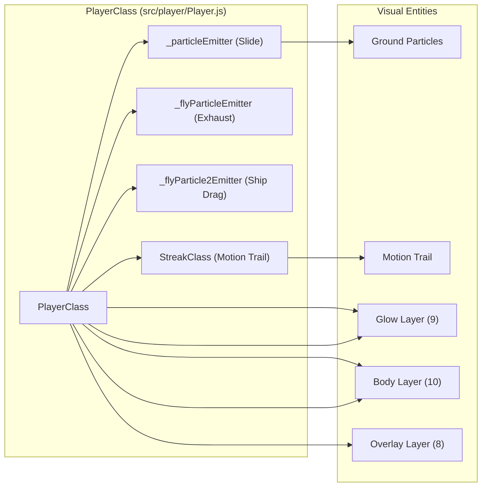
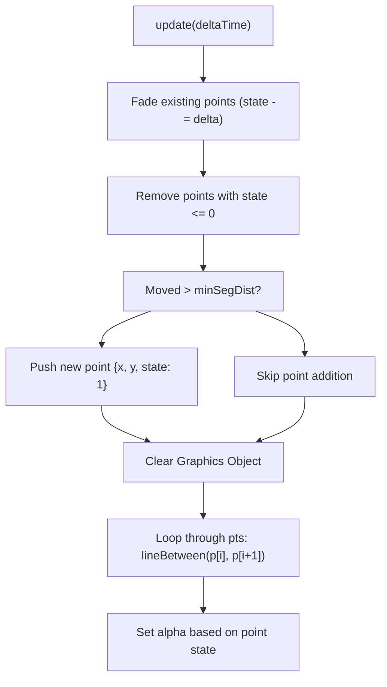

# Player Rendering & Visual Effects
Relevant source files
- [src/player/Player.js](https://github.com/brokemutt/gdweb/blob/1c1d347a/src/player/Player.js)
- [src/player/PlayerRenderer.js](https://github.com/brokemutt/gdweb/blob/1c1d347a/src/player/PlayerRenderer.js)

The player's visual representation in `gdweb` is a sophisticated multi-layered system that decouples logical physics coordinates from screen-space rendering. This system handles smooth rotation blending, mode-specific sprite swapping (Cube vs. Ship), and a suite of particle effects that respond to movement and collision states.

## Multi-Layer Sprite Stack

The player is not a single sprite but a collection of layers managed by `PlayerClass`. This allows for independent tinting of the body, overlays, and glow effects to match the original Geometry Dash aesthetic.

### Layer Composition

The system initializes two sets of layers: one for Cube mode and one for Ship mode. Each set consists of four distinct images created via `createSpriteLayer` in `src/player/PlayerRenderer.js`[src/player/PlayerRenderer.js114-123](https://github.com/brokemutt/gdweb/blob/1c1d347a/src/player/PlayerRenderer.js#L114-L123)

| Layer | Frame Example (Cube) | Depth | Purpose |
| --- | --- | --- | --- |
| **Glow** | `player_01_glow_001.png` | 9 | Outer silhouette glow, typically tinted blue [src/player/Player.js39-47](https://github.com/brokemutt/gdweb/blob/1c1d347a/src/player/Player.js#L39-L47) |
| **Body** | `player_01_001.png` | 10 | Primary colorable surface, typically tinted green [src/player/Player.js40-50](https://github.com/brokemutt/gdweb/blob/1c1d347a/src/player/Player.js#L40-L50) |
| **Overlay** | `player_01_2_001.png` | 8 | Secondary detail layer, typically tinted blue [src/player/Player.js41-62](https://github.com/brokemutt/gdweb/blob/1c1d347a/src/player/Player.js#L41-L62) |
| **Extra** | `player_01_extra_001.png` | 12 | Top-most detail layer (e.g., eyes/accents) [src/player/Player.js42](https://github.com/brokemutt/gdweb/blob/1c1d347a/src/player/Player.js#L42-L42) |

### Sprite Synchronization

The `syncSprites` method is responsible for bridging the gap between the physics state (`this.p`) and the Phaser GameObjects.

1. **Coordinate Transformation**: Converts the internal world Y coordinate to screen space using `worldYToScreenY`[src/player/Player.js33-34](https://github.com/brokemutt/gdweb/blob/1c1d347a/src/player/Player.js#L33-L34)
2. **Visibility Toggling**: Based on `this.p.isFlying`, the system toggles the visibility of the `_playerLayers` and `_shipLayers` arrays [src/player/Player.js93-108](https://github.com/brokemutt/gdweb/blob/1c1d347a/src/player/Player.js#L93-L108)
3. **Rotation Application**: Applies the calculated `_rotation` to all active sprites [src/player/Player.js15](https://github.com/brokemutt/gdweb/blob/1c1d347a/src/player/Player.js#L15-L15)

## Rotation & Blending

Player rotation is handled differently depending on the movement mode. The system uses `slerp2D` (Spherical Linear Interpolation) logic to ensure smooth transitions, especially in Ship mode.

### Cube Rotation

In Cube mode, rotation is typically driven by `rotateActionActive`. When the player jumps, a rotation tween is initiated to flip the cube 90 or 180 degrees to land flat on its face [src/player/Player.js16-20](https://github.com/brokemutt/gdweb/blob/1c1d347a/src/player/Player.js#L16-L20)

### Ship Rotation

In Ship mode, the rotation is determined by the player's Y velocity. The ship tilts upward when ascending and downward when descending. The `PlayerClass` calculates the target angle based on the velocity vector and applies it to the `shipSprite`[src/player/Player.js92](https://github.com/brokemutt/gdweb/blob/1c1d347a/src/player/Player.js#L92-L92)

## Particle Systems

`PlayerClass` manages four primary particle emitters to provide tactile feedback for movement. These are initialized in `_initParticles` and added to the game layer container [src/player/Player.js110-141](https://github.com/brokemutt/gdweb/blob/1c1d347a/src/player/Player.js#L110-L141)

### Emitter Types

| Emitter | Trigger | Behavior |
| --- | --- | --- |
| `_particleEmitter` | Ground Slide | Emits `square.png` particles when `onGround` is true. Tinted `COLOR_GREEN`[src/player/Player.js112-137](https://github.com/brokemutt/gdweb/blob/1c1d347a/src/player/Player.js#L112-L137) |
| `_flyParticleEmitter` | Ship Exhaust | Constant low-speed trail while in Ship mode [src/player/Player.js144-173](https://github.com/brokemutt/gdweb/blob/1c1d347a/src/player/Player.js#L144-L173) |
| `_flyParticle2Emitter` | Ship Drag | High-speed particles emitted when the ship is moving rapidly [src/player/Player.js179-191](https://github.com/brokemutt/gdweb/blob/1c1d347a/src/player/Player.js#L179-L191) |
| `_landParticleEmitter` | Landing | A one-shot burst of particles triggered when `onGround` transitions from false to true [src/player/Player.js27](https://github.com/brokemutt/gdweb/blob/1c1d347a/src/player/Player.js#L27-L27) |

### Particle Implementation Diagram

This diagram shows the relationship between the `PlayerClass` and its visual components.

**Sources:**[src/player/Player.js10-109](https://github.com/brokemutt/gdweb/blob/1c1d347a/src/player/Player.js#L10-L109)[src/player/Player.js110-191](https://github.com/brokemutt/gdweb/blob/1c1d347a/src/player/Player.js#L110-L191)[src/player/PlayerRenderer.js114-123](https://github.com/brokemutt/gdweb/blob/1c1d347a/src/player/PlayerRenderer.js#L114-L123)

## Motion Trails (StreakClass)

The `StreakClass` in `src/player/PlayerRenderer.js` implements the smooth, fading trail that follows the player during high-speed movement or flight.

### Implementation Details

- **Data Structure**: Uses an array of points `this._pts`, where each point contains an `x`, `y`, and a `state` (alpha/lifetime) [src/player/PlayerRenderer.js17](https://github.com/brokemutt/gdweb/blob/1c1d347a/src/player/PlayerRenderer.js#L17-L17)
- **Update Loop**: In every `update(deltaTime)`, it reduces the `state` of existing points by `_fadeDelta`. Points with `state <= 0` are culled [src/player/PlayerRenderer.js47-62](https://github.com/brokemutt/gdweb/blob/1c1d347a/src/player/PlayerRenderer.js#L47-L62)
- **Point Generation**: A new point is added only if the player has moved beyond `_minSegDist` from the last point, preventing point stacking during idle frames [src/player/PlayerRenderer.js64-96](https://github.com/brokemutt/gdweb/blob/1c1d347a/src/player/PlayerRenderer.js#L64-L96)
- **Rendering**: Uses `Phaser.GameObjects.Graphics` with `BLEND_ADD`. It iterates through the points and draws lines between them using `lineBetween`, with the alpha calculated from the points' remaining `state`[src/player/PlayerRenderer.js98-110](https://github.com/brokemutt/gdweb/blob/1c1d347a/src/player/PlayerRenderer.js#L98-L110)

### Streak Logic Flow

**Sources:**[src/player/PlayerRenderer.js8-111](https://github.com/brokemutt/gdweb/blob/1c1d347a/src/player/PlayerRenderer.js#L8-L111)

## Coordinate Bridging

The `syncSprites` function acts as the critical bridge between the physics simulation (which operates in a custom coordinate space) and the Phaser renderer.

| Logic Entity | Code Reference | Role |
| --- | --- | --- |
| **Physics State** | `this.p` (GameState) | Holds `x`, `y`, `yVelocity`, `isFlying`[src/player/Player.js13](https://github.com/brokemutt/gdweb/blob/1c1d347a/src/player/Player.js#L13-L13) |
| **Bridge Function** | `syncSprites` | Translates `p.y` to screen Y and updates all layer positions [src/player/Player.js31-35](https://github.com/brokemutt/gdweb/blob/1c1d347a/src/player/Player.js#L31-L35) |
| **Screen Transform** | `worldYToScreenY` | Constant-based utility to flip/offset the Y axis for rendering [src/constants.js6](https://github.com/brokemutt/gdweb/blob/1c1d347a/src/constants.js#L6-L6) |
| **Target Sprites** | `_allLayers` | Array of Image objects that receive the translated coordinates [src/player/Player.js105-108](https://github.com/brokemutt/gdweb/blob/1c1d347a/src/player/Player.js#L105-L108) |

**Sources:**[src/player/Player.js11-35](https://github.com/brokemutt/gdweb/blob/1c1d347a/src/player/Player.js#L11-L35)[src/player/Player.js93-109](https://github.com/brokemutt/gdweb/blob/1c1d347a/src/player/Player.js#L93-L109)[src/constants.js6](https://github.com/brokemutt/gdweb/blob/1c1d347a/src/constants.js#L6-L6)