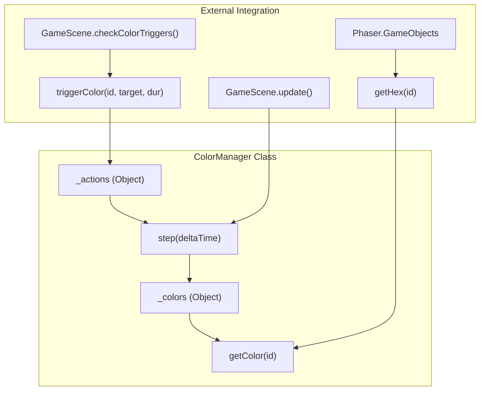
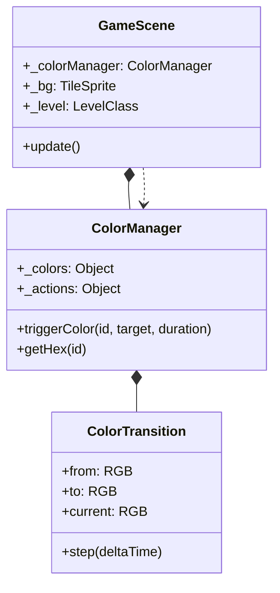

# Color Manager
Relevant source files
- [src/scenes/GameScene.js](https://github.com/brokemutt/gdweb/blob/1c1d347a/src/scenes/GameScene.js)
- [src/systems/ColorManager.js](https://github.com/brokemutt/gdweb/blob/1c1d347a/src/systems/ColorManager.js)

The `ColorManager` system handles the state, interpolation, and retrieval of environmental colors within the game. It specifically manages the background and ground colors, allowing for smooth transitions (tweens) triggered by level events.

### Core Constants and Defaults

The system identifies specific game elements using unique ID constants. By default, the manager initializes with the classic Geometry Dash blue color scheme.

| Constant | Value | Description | Default RGB |
| --- | --- | --- | --- |
| `ID_BACKGROUND_COLOR` | `1000` | The ID for the main background tile sprite. | `0, 102, 255` |
| `ID_GROUND_COLOR` | `1001` | The ID for the ground/floor tiles. | `0, 68, 170` |

Sources: [src/systems/ColorManager.js6-7](https://github.com/brokemutt/gdweb/blob/1c1d347a/src/systems/ColorManager.js#L6-L7)[src/systems/ColorManager.js49-54](https://github.com/brokemutt/gdweb/blob/1c1d347a/src/systems/ColorManager.js#L49-L54)

---

### ColorTransition Logic

The `ColorTransition` class is a utility used to interpolate between two RGB states over a specified duration. It utilizes a Linear Interpolation (LERP) formula to calculate the intermediate color values every frame.

**Interpolation Formula:**
For each channel ($C \in {r, g, b}$):
$C_{current} = C_{from} + (C_{to} - C_{from}) \times \min(\frac{elapsed}{duration}, 1)$

**Key Properties:**

- `done`: A boolean flag set to `true` when the `elapsed` time reaches or exceeds the `duration`[src/systems/ColorManager.js21-22](https://github.com/brokemutt/gdweb/blob/1c1d347a/src/systems/ColorManager.js#L21-L22)
- `step(deltaTime)`: Updates the `elapsed` timer and recalculates the `current` RGB object [src/systems/ColorManager.js24-38](https://github.com/brokemutt/gdweb/blob/1c1d347a/src/systems/ColorManager.js#L24-L38)

Sources: [src/systems/ColorManager.js10-39](https://github.com/brokemutt/gdweb/blob/1c1d347a/src/systems/ColorManager.js#L10-L39)

---

### ColorManager Implementation

The `ColorManager` class maintains the current state of all active colors and any ongoing transitions.

#### Lifecycle and Data Flow

The `ColorManager` is instantiated in `GameScene` and updated within the main game loop.

**Color State Management Diagram**

Sources: [src/systems/ColorManager.js42-88](https://github.com/brokemutt/gdweb/blob/1c1d347a/src/systems/ColorManager.js#L42-L88)[src/scenes/GameScene.js47](https://github.com/brokemutt/gdweb/blob/1c1d347a/src/scenes/GameScene.js#L47-L47)

#### Key Methods

- **`triggerColor(colorId, targetColor, duration)`**: Initiates a change. If `duration` is 0, the change is applied instantly to the `_colors` map. Otherwise, a new `ColorTransition` is added to the `_actions` object [src/systems/ColorManager.js59-66](https://github.com/brokemutt/gdweb/blob/1c1d347a/src/systems/ColorManager.js#L59-L66)
- **`step(deltaTime)`**: Iterates through all active `_actions`. It calls `transition.step()`, updates the main `_colors` storage with the new intermediate values, and deletes the action once the transition is complete [src/systems/ColorManager.js67-74](https://github.com/brokemutt/gdweb/blob/1c1d347a/src/systems/ColorManager.js#L67-L74)
- **`getHex(colorId)`**: Converts the stored RGB object into a single hex integer using bitwise shifts (`r << 16 | g << 8 | b`), making it compatible with Phaser's `setTint()` method [src/systems/ColorManager.js84-87](https://github.com/brokemutt/gdweb/blob/1c1d347a/src/systems/ColorManager.js#L84-L87)

---

### GameScene Integration

The `ColorManager` is a critical dependency of `GameScene`, which coordinates the visual application of colors to the environment.

**System Association Diagram**

Sources: [src/scenes/GameScene.js47](https://github.com/brokemutt/gdweb/blob/1c1d347a/src/scenes/GameScene.js#L47-L47)[src/scenes/GameScene.js82-83](https://github.com/brokemutt/gdweb/blob/1c1d347a/src/scenes/GameScene.js#L82-L83)

#### Application of Colors

1. **Initialization**: During `GameScene.create()`, the background (`_bg`) and ground (`_level`) are tinted using the initial values from the manager [src/scenes/GameScene.js82-83](https://github.com/brokemutt/gdweb/blob/1c1d347a/src/scenes/GameScene.js#L82-L83)
2. **Triggering**: The game checks for color triggers (typically defined in the level data) via `checkColorTriggers`. When a trigger is hit, it calls `_colorManager.triggerColor()`[src/scenes/GameScene.js10](https://github.com/brokemutt/gdweb/blob/1c1d347a/src/scenes/GameScene.js#L10-L10)
3. **Updating**: In every frame of the physics/game loop, `_colorManager.step(deltaTime)` is called to process transitions. The resulting hex values are then re-applied to the background tile sprite and the ground rendering system.

Sources: [src/systems/ColorManager.js59-74](https://github.com/brokemutt/gdweb/blob/1c1d347a/src/systems/ColorManager.js#L59-L74)[src/scenes/GameScene.js82-83](https://github.com/brokemutt/gdweb/blob/1c1d347a/src/scenes/GameScene.js#L82-L83)