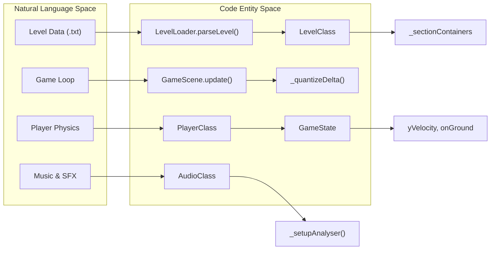
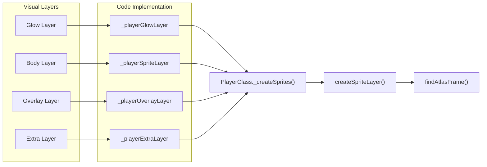
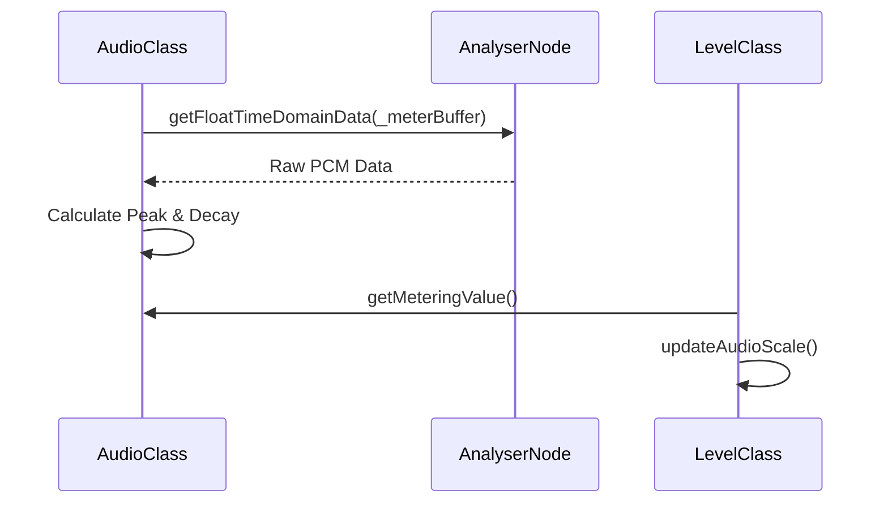

# Glossary
Relevant source files
- [README.md](https://github.com/brokemutt/gdweb/blob/1c1d347a/README.md?plain=1)
- [src/constants.js](https://github.com/brokemutt/gdweb/blob/1c1d347a/src/constants.js)
- [src/effects.js](https://github.com/brokemutt/gdweb/blob/1c1d347a/src/effects.js)
- [src/player/Player.js](https://github.com/brokemutt/gdweb/blob/1c1d347a/src/player/Player.js)
- [src/player/PlayerRenderer.js](https://github.com/brokemutt/gdweb/blob/1c1d347a/src/player/PlayerRenderer.js)
- [src/scenes/BootScene.js](https://github.com/brokemutt/gdweb/blob/1c1d347a/src/scenes/BootScene.js)
- [src/scenes/GameScene.js](https://github.com/brokemutt/gdweb/blob/1c1d347a/src/scenes/GameScene.js)
- [src/systems/AudioManager.js](https://github.com/brokemutt/gdweb/blob/1c1d347a/src/systems/AudioManager.js)
- [src/systems/BitmapFontParser.js](https://github.com/brokemutt/gdweb/blob/1c1d347a/src/systems/BitmapFontParser.js)
- [src/systems/ColorManager.js](https://github.com/brokemutt/gdweb/blob/1c1d347a/src/systems/ColorManager.js)
- [src/systems/GameState.js](https://github.com/brokemutt/gdweb/blob/1c1d347a/src/systems/GameState.js)
- [src/world/Level.js](https://github.com/brokemutt/gdweb/blob/1c1d347a/src/world/Level.js)
- [src/world/LevelLoader.js](https://github.com/brokemutt/gdweb/blob/1c1d347a/src/world/LevelLoader.js)

This page provides a comprehensive reference of domain-specific terminology, architectural concepts, and internal abbreviations used throughout the `gdweb` codebase. It serves as a technical bridge for engineers to map gameplay concepts to their underlying implementation.

## Core Domain Concepts

### World vs. Screen Coordinates

The game uses a split coordinate system. Physics and level layout are calculated in **World Space**, while rendering occurs in **Screen Space**.

- **World Y**: Measured from the ground up. 0 is the floor [src/world/Level.js51](https://github.com/brokemutt/gdweb/blob/1c1d347a/src/world/Level.js#L51-L51)
- **Screen Y**: Standard screen-space where 0 is the top.
- **Conversion**: The utility function `worldYToScreenY(worldY)` performs the transformation: `GROUND_BOUNDS_Y - worldY`[src/constants.js36-38](https://github.com/brokemutt/gdweb/blob/1c1d347a/src/constants.js#L36-L38)

### Delta Quantization

To ensure deterministic physics regardless of the monitor's refresh rate, the game uses a sub-stepping loop.

- **TICK_DELTA**: The fixed simulation step (1/240th of a second, or 240Hz) [src/constants.js18](https://github.com/brokemutt/gdweb/blob/1c1d347a/src/constants.js#L18-L18)
- **Implementation**: The `GameScene` accumulates frame deltas into a buffer and executes the physics loop only when enough time has passed to satisfy one or more `TICK_DELTA` steps.

### Object Definitions

Level objects are defined by a schema that maps raw data IDs to visual frames and physical hitboxes.

- **OBJECT_DEFINITIONS**: A lookup table in `LevelLoader.js` that assigns properties (frame name, hitbox dimensions, object type) to numeric IDs parsed from the level file [src/world/LevelLoader.js9](https://github.com/brokemutt/gdweb/blob/1c1d347a/src/world/LevelLoader.js#L9-L9)

---

## Entity Mapping: Natural Language to Code Space

The following diagrams illustrate how abstract game concepts are represented by specific classes and functions in the codebase.

### System Orchestration Diagram

This diagram shows the relationship between high-level game states and the underlying system classes.

**Sources:**[src/scenes/GameScene.js43-48](https://github.com/brokemutt/gdweb/blob/1c1d347a/src/scenes/GameScene.js#L43-L48)[src/world/Level.js11-12](https://github.com/brokemutt/gdweb/blob/1c1d347a/src/world/Level.js#L11-L12)[src/systems/AudioManager.js4](https://github.com/brokemutt/gdweb/blob/1c1d347a/src/systems/AudioManager.js#L4-L4)[src/systems/GameState.js4](https://github.com/brokemutt/gdweb/blob/1c1d347a/src/systems/GameState.js#L4-L4)

### Player Rendering Stack

The player is not a single sprite but a composite of multiple layers managed by the renderer.

**Sources:**[src/player/Player.js31-42](https://github.com/brokemutt/gdweb/blob/1c1d347a/src/player/Player.js#L31-L42)[src/player/PlayerRenderer.js114](https://github.com/brokemutt/gdweb/blob/1c1d347a/src/player/PlayerRenderer.js#L114-L114)[src/systems/GameState.js34](https://github.com/brokemutt/gdweb/blob/1c1d347a/src/systems/GameState.js#L34-L34)

---

## Technical Glossary

| Term | Definition | File/Function Pointer |
| --- | --- | --- |
| **Atlas** | A texture atlas containing all game sprites (GJ_WebSheet). | [src/scenes/BootScene.js37](https://github.com/brokemutt/gdweb/blob/1c1d347a/src/scenes/BootScene.js#L37-L37) |
| **BMFont** | AngelCode Bitmap Font format used for `bigFont` and `goldFont`. | [src/systems/BitmapFontParser.js8](https://github.com/brokemutt/gdweb/blob/1c1d347a/src/systems/BitmapFontParser.js#L8-L8) |
| **Color Trigger** | An event in the level that changes the background or ground color. | [src/systems/ColorManager.js59](https://github.com/brokemutt/gdweb/blob/1c1d347a/src/systems/ColorManager.js#L59-L59) |
| **Ground Bounds** | The fixed Y-coordinate (460) where the floor line is drawn. | [src/constants.js33](https://github.com/brokemutt/gdweb/blob/1c1d347a/src/constants.js#L33-L33) |
| **Metering** | Real-time analysis of audio frequencies to drive visual scaling. | [src/systems/AudioManager.js92-98](https://github.com/brokemutt/gdweb/blob/1c1d347a/src/systems/AudioManager.js#L92-L98) |
| **Parallax** | The background scrolling effect controlled by `_bgSpeedX`. | [src/scenes/GameScene.js22-23](https://github.com/brokemutt/gdweb/blob/1c1d347a/src/scenes/GameScene.js#L22-L23) |
| **Section Culling** | Dividing the level into 400px chunks for performance. | [src/world/Level.js48-49](https://github.com/brokemutt/gdweb/blob/1c1d347a/src/world/Level.js#L48-L49) |
| **Streak** | The motion trail effect following the player. | [src/player/PlayerRenderer.js8](https://github.com/brokemutt/gdweb/blob/1c1d347a/src/player/PlayerRenderer.js#L8-L8) |

---

## Component Interactions

### Audio Metering Data Flow

The `AudioClass` uses the Web Audio API to extract volume data, which is then consumed by the `LevelClass` to animate objects.

**Sources:**[src/systems/AudioManager.js100-138](https://github.com/brokemutt/gdweb/blob/1c1d347a/src/systems/AudioManager.js#L100-L138)[src/world/Level.js38](https://github.com/brokemutt/gdweb/blob/1c1d347a/src/world/Level.js#L38-L38)

### Level Loading Pipeline

Level data undergoes several transformations before appearing on screen.

| Step | Action | Function |
| --- | --- | --- |
| 1 | Fetch raw string | `this.load.text("level_1", ...)`[src/scenes/BootScene.js49](https://github.com/brokemutt/gdweb/blob/1c1d347a/src/scenes/BootScene.js#L49-L49) |
| 2 | Parse objects | `parseLevel(level)`[src/world/LevelLoader.js5](https://github.com/brokemutt/gdweb/blob/1c1d347a/src/world/LevelLoader.js#L5-L5) |
| 3 | Define Hitboxes | `getObjectDefinition(id)`[src/world/LevelLoader.js9](https://github.com/brokemutt/gdweb/blob/1c1d347a/src/world/LevelLoader.js#L9-L9) |
| 4 | Spawn Sprites | `_spawnLevelObjects(parsed)`[src/world/Level.js62](https://github.com/brokemutt/gdweb/blob/1c1d347a/src/world/Level.js#L62-L62) |
| 5 | Spatial Hash | Assign to `_sectionContainers`[src/world/Level.js45](https://github.com/brokemutt/gdweb/blob/1c1d347a/src/world/Level.js#L45-L45) |

**Sources:**[src/scenes/BootScene.js49](https://github.com/brokemutt/gdweb/blob/1c1d347a/src/scenes/BootScene.js#L49-L49)[src/world/Level.js58-63](https://github.com/brokemutt/gdweb/blob/1c1d347a/src/world/Level.js#L58-L63)[src/world/LevelLoader.js5-9](https://github.com/brokemutt/gdweb/blob/1c1d347a/src/world/LevelLoader.js#L5-L9)